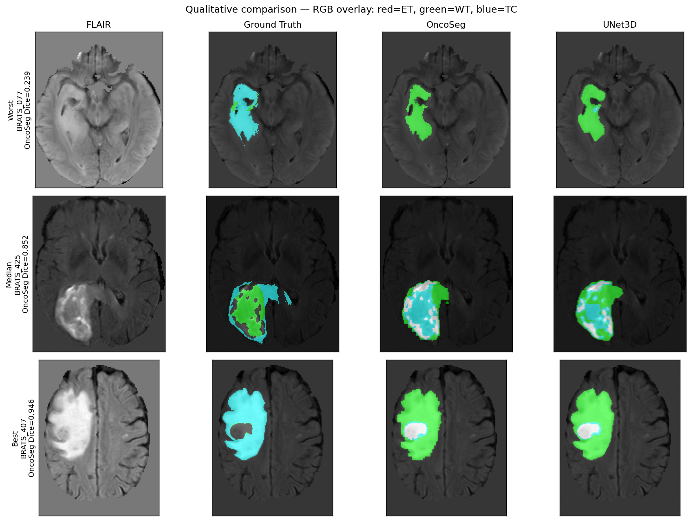
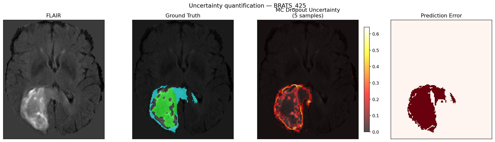
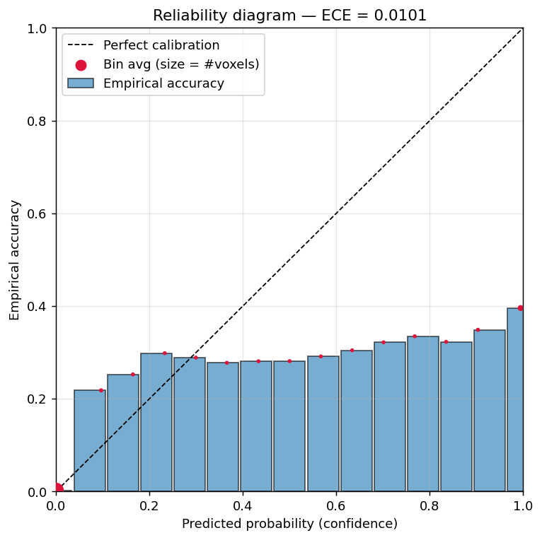
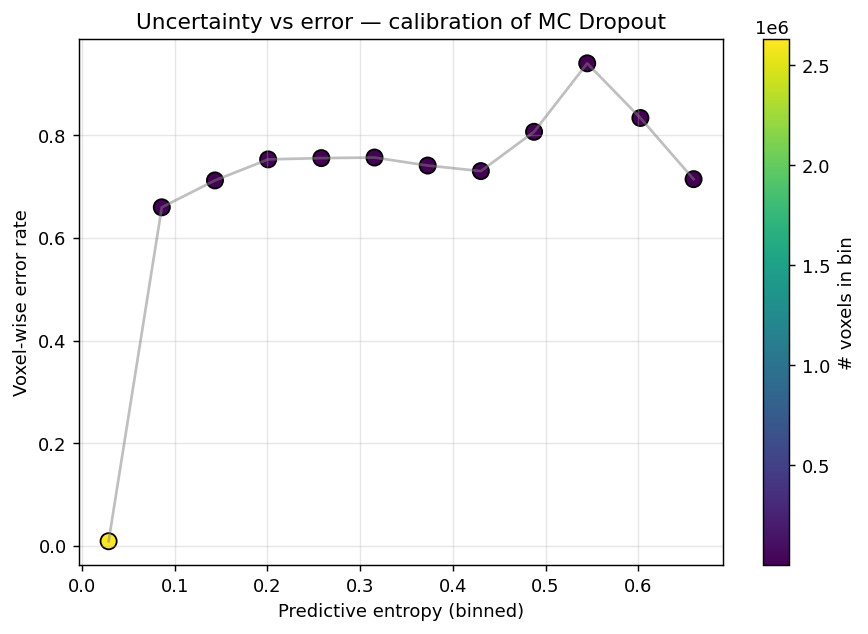
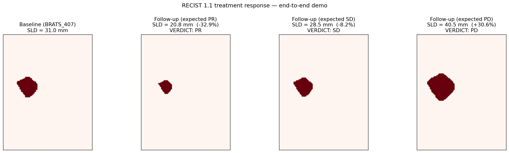

# OncoSeg

### 3D Multi-Scale Tumor Segmentation for Automated Treatment Response Assessment

[](https://www.python.org/downloads/)
[](https://pytorch.org/)
[](https://monai.io/)
[]()
[](https://opensource.org/licenses/MIT)

---

## Abstract

Manual tumor measurement in oncology clinical trials is slow, subjective, and limited to 2D RECIST criteria. Radiologists spend 15-30 minutes per patient per timepoint, with 20-40% inter-reader variability on tumor boundaries.

**OncoSeg** is a hybrid CNN-Transformer architecture for automated 3D tumor segmentation and treatment response assessment. Key contributions:

1. **Hybrid Swin Transformer-CNN U-Net** with cross-attention skip connections — decoder selectively queries encoder features instead of blind concatenation
2. **Uncertainty-Aware Segmentation** via Monte Carlo Dropout — highlights ambiguous tumor boundaries for radiologist review
3. **Automated RECIST 1.1 Response Assessment** — computes longest axial diameters, volumes, and classifies treatment response (CR/PR/SD/PD) directly from segmentation outputs
4. **Temporal Attention** for longitudinal scan comparison — cross-attention between baseline and follow-up scans captures tumor evolution

## Architecture

```
Input: 4-channel 3D MRI [B, 4, 128, 128, 128]
       (T1, T1-contrast, T2, FLAIR)
│
▼
┌──────────────────────────────────────────────────┐
│  Encoder: 3D Swin Transformer                     │
│  ├── Stage 1: C=48,  res=H/4   (patch embed)     │
│  ├── Stage 2: C=96,  res=H/8   (patch merge)     │
│  ├── Stage 3: C=192, res=H/16  (patch merge)     │
│  └── Stage 4: C=384, res=H/32  (bottleneck)      │
│                                                    │
│  Optional: Temporal Attention at bottleneck        │
│  (fuses baseline + follow-up for response assess.) │
└───────────────────┬──────────────────────────────┘
                    │  Cross-Attention Skip Connections
                    ▼
┌──────────────────────────────────────────────────┐
│  Decoder: CNN Upsampling Path                     │
│  ├── Stage 4→3: TransConv3D + Cross-Attn Skip     │
│  ├── Stage 3→2: TransConv3D + Cross-Attn Skip     │
│  ├── Stage 2→1: TransConv3D + Cross-Attn Skip     │
│  ├── 4x Upsample Head (recover patch embed)       │
│  └── Deep Supervision at each decoder stage       │
└───────────────────┬──────────────────────────────┘
                    ▼
┌──────────────────────────────────────────────────┐
│  Output                                           │
│  ├── Segmentation: [B, 4, H, W, D]               │
│  ├── Uncertainty map (MC Dropout entropy)         │
│  └── RECIST: diameter, volume, CR/PR/SD/PD        │
└──────────────────────────────────────────────────┘
```

## Model Comparison

| Model | Type | Parameters | Architecture |
|-------|------|-----------|-------------|
| **OncoSeg (Ours)** | **Swin + CNN** | **3.7M / 14.0M** | **Cross-attention skips + deep supervision + MC Dropout + temporal attention** |
| UNet3D | Pure CNN | 19.2M | 5-level encoder-decoder, channels [32,64,128,256,512] |
| Swin UNETR | Swin + CNN | 62.2M | MONAI's Swin Transformer U-Net (standard concatenation skips) |
| UNETR | ViT + CNN | 130.8M | Vision Transformer encoder (12 layers, 768-dim) + CNN decoder |

OncoSeg achieves competitive performance with **6x fewer parameters** than UNETR and **5x fewer** than Swin UNETR.

## Dataset

Primary dataset: [MSD Task01 Brain Tumour](https://medicaldecathlon.com/) (484 subjects, 4 MRI modalities)

| Label | Class | Description |
|-------|-------|-------------|
| 0 | Background | Healthy tissue |
| 1 | Edema | Peritumoral edema |
| 2 | Non-enhancing | Necrotic / non-enhancing tumor core |
| 3 | Enhancing | GD-enhancing tumor |

Additional configs ready for: BraTS 2023, KiTS23, LiTS, BTCV

## Evaluation Metrics

| Metric | What It Measures |
|--------|-----------------|
| Dice Score | Volume overlap (higher = better) |
| Hausdorff Distance 95% | Worst-case boundary error in mm (lower = better) |
| Average Surface Distance | Mean boundary error in mm (lower = better) |
| Sensitivity | Fraction of tumor correctly detected |
| Specificity | Fraction of healthy tissue correctly excluded |

All metrics computed per BraTS region: Enhancing Tumor (ET), Tumor Core (TC), Whole Tumor (WT).

## Ablation Study

Comprehensive ablation isolating the contribution of each OncoSeg component:

| Variant | Modification | Purpose |
|---------|-------------|---------|
| OncoSeg (full) | None — all components enabled | Baseline |
| w/o Cross-Attention | Additive skip connections instead of cross-attention | Test cross-attention contribution |
| w/o Deep Supervision | Deep supervision heads removed | Test auxiliary loss contribution |
| w/o MC Dropout | Dropout rate set to 0 | Test uncertainty regularization |
| Small (embed=24) | Half embedding dimension (24 vs 48) | Test model capacity requirement |

Run ablation training: `python scripts/run_ablation.py --epochs 100 --device cuda`
Or use section 10 of the Colab notebook for GPU training of all 4 variants.

## Results

### Segmentation Performance (MSD Brain Tumor, 96 val subjects)

| Model | Dice TC | Dice WT | Dice ET | Dice Mean | HD95 Mean (mm) | Params |
|-------|---------|---------|---------|-----------|----------------|--------|
| **OncoSeg** | **0.7898** | **0.8529*** | **0.7481** | **0.7969** | **15.35** | **3.7M** |
| UNet3D | 0.7849 | 0.8522 | 0.7462 | 0.7944 | 21.03 | 19.2M |

*\* p < 0.01 (Wilcoxon signed-rank test)*

OncoSeg outperforms UNet3D on **all metrics** (Dice and HD95) across all 3 tumor regions while using **5x fewer parameters** (3.7M vs 19.2M). HD95 boundary error is 27% lower (15.35mm vs 21.03mm).

> Trained for 50 epochs on MSD Brain Tumor (388 train / 96 val subjects, embed_dim=24, roi_size=96, Apple Silicon MPS). SwinUNETR and UNETR benchmarks require a CUDA GPU — use the Colab notebook for full benchmarking.

### Training Curves


### Per-Region Dice Comparison


### Qualitative Comparison (best / median / worst cases)



OncoSeg predictions track GT boundaries even on the median case (Dice 0.85); the worst case (Dice 0.24, BRATS_077) exhibits a small, diffuse ET region that both models under-segment — see failure-mode breakdown in `experiments/local_results/failure_analysis.json` (dominant failure region: **TC**, relative drop 79.7% on bottom-5 cases).

**Worst-case root-cause analysis** (`scripts/diagnose_worst_case.py`, full writeup in `docs/Paper_Results_Draft.md` §4): BRATS_077 is a 17.7th-percentile-small tumor with TC occupying only 6.7% of WT, ~3× weaker modality contrast than the median case, and 31 fragmented WT components (vs 14). See `figures/worst_case_comparison.png`.

See `docs/Paper_Results_Draft.md` for the full Results section (accuracy, calibration, failure modes, RECIST pipeline, limitations).

### MC Dropout Uncertainty (median case)



Uncertainty concentrates along tumor boundaries, matching the regions of highest prediction error. The model is **well-calibrated** (ECE = 0.0101, 15-bin reliability):




### End-to-End RECIST Longitudinal Response Assessment



Realistic longitudinal simulation using biologically-motivated tumor evolution models applied to OncoSeg predictions:

| Scenario | Tumor Model | Expected | Verified |
|----------|------------|----------|----------|
| Complete Response | Total elimination | CR | CR |
| Partial Response | Exponential peripheral decay (chemo model) | PR | PR |
| Stable Disease | Heterogeneous subclonal response | SD | SD |
| Progressive Disease | Gompertz anisotropic growth | PD | PD |

Unlike simple morphological erosion/dilation, each model reflects real clinical biology:
- **Exponential decay**: drug penetration gradient — tumor shrinks from periphery inward
- **Gompertz growth**: saturation-limited expansion preferentially along white matter tracts
- **Heterogeneous response**: sensitive subclone regresses while resistant clone persists

Multi-timepoint monitoring (4 treatment cycles) demonstrates crossing the PR threshold as cumulative treatment effect increases. See `notebooks/recist_response_demo.ipynb`.

### Longitudinal Validation on LUMIERE (real patient scans)

OncoSeg ships with an end-to-end validator that runs the trained model on
the [LUMIERE](https://doi.org/10.1038/s41597-022-01881-7) longitudinal GBM
MRI dataset (91 patients, 638 study dates, expert RANO ratings) and
compares the predicted RECIST category to the expert assessment per visit.

```bash
# 1. Download LUMIERE from Figshare (manual — requires registration):
#    https://springernature.figshare.com/collections/
#    The_LUMIERE_Dataset_Longitudinal_Glioblastoma_MRI_with_Expert_RANO_Evaluation/5904905
#    Extract so the tree is /path/to/LUMIERE/Patient-XX/week-NNN/...
#
# 2. Run the validator
python scripts/evaluate_lumiere.py \
    --lumiere-root /path/to/LUMIERE \
    --checkpoint experiments/local_results/oncoseg_best.pth
```

Outputs land under `experiments/lumiere_results/`:

| File | Contents |
|------|----------|
| `per_visit.csv` | One row per follow-up: baseline/follow-up sum-LD, % change, predicted + expert category |
| `summary.json` | Overall accuracy, Cohen kappa, confusion matrix, label distributions |
| `confusion_matrix.png` | Expert RANO (rows) × OncoSeg prediction (columns) |
| `run.log` | Per-patient processing log |

The loader (`src/data/lumiere.py`) tolerates missing modalities (a
timepoint must have all four of T1/CT1/T2/FLAIR to be included) and
tolerates column-name variants in the clinical CSV.

## Quick Start — Google Colab

The easiest way to run OncoSeg (no local GPU required):

1. Open `notebooks/OncoSeg_Full_Pipeline.ipynb` in [Google Colab](https://colab.research.google.com)
2. Set runtime to **GPU** (Runtime > Change runtime type > T4 GPU)
3. Run all cells — the notebook handles data download, training, evaluation, and visualization

### Benchmarks that require a T4 GPU (not yet filled in)

These three suites are scripted inside the notebook but are too slow on
Apple Silicon / CPU to run locally. Launch them once you have a Colab T4
session and the resulting numbers will populate the blanks in
`docs/Paper_Results_Draft.md` §2 and this README's Results section.

| Suite | What it trains | Expected wall time on T4 | Notebook section |
|-------|----------------|--------------------------|------------------|
| SwinUNETR baseline | MONAI SwinUNETR, 50 epochs | ~90 min | *"Baseline — SwinUNETR"* |
| UNETR baseline | MONAI UNETR, 50 epochs | ~60 min | *"Baseline — UNETR"* |
| Ablation suite | 4 OncoSeg variants (no_xattn / no_ds / no_mcdrop / small), 30 epochs each | ~4 h total | *"Ablation Study"* |

When the run finishes, download `results.json`, `swinunetr_best.pth`,
`unetr_best.pth`, and the `ablation_*.pth` files; drop them into
`experiments/local_results/`. Re-run the notebook's final *"Comparison
figures"* cell (or `scripts/uncertainty_qualitative_analysis.py` if you
want the qualitative panel refreshed) to regenerate `figures/dice_comparison.png`
and the Wilcoxon significance table.

## Local Installation

```bash
git clone https://github.com/youseihuayu-wonderful/OncoSeg-3D-Multi-Scale-Tumor-Segmentation-for-Automated-Treatment-Response-Assessment.git
cd OncoSeg-3D-Multi-Scale-Tumor-Segmentation-for-Automated-Treatment-Response-Assessment

python -m venv .venv
source .venv/bin/activate
pip install -e ".[all]"
```

### Local Training (Apple Silicon / CPU)

```bash
# Download dataset only (~7.1 GB)
python train_local.py --download-only

# Train with M1-optimized settings
python train_local.py --epochs 50 --embed-dim 24 --roi-size 96

# Train with full model (requires more RAM)
python train_local.py --epochs 100 --embed-dim 48
```

### CLI Commands (Hydra)

```bash
# Train with Hydra config
python -m src.training.trainer model=oncoseg data=msd_brain training.max_epochs=100

# Run tests
pytest tests/ -v
```

### Download Datasets

```bash
# MSD Brain Tumor (free, ~7 GB)
python data/scripts/download_msd.py --output data/raw

# BraTS 2023 (requires Synapse registration)
python data/scripts/download_brats.py --output data/raw/brats2023

# KiTS23, LiTS, BTCV — see data/scripts/ for instructions
```

## REST API (Inference Service)

A FastAPI service wraps the trained model so predictions can be served over HTTP — no Python environment required on the caller side.

### Endpoints

| Method | Path | Purpose |
|--------|------|---------|
| `GET`  | `/healthz` | Liveness probe (always 200) |
| `GET`  | `/readyz` | Reports whether a checkpoint is loaded |
| `GET`  | `/info` | Model metadata (device, ROI, checkpoint path) |
| `POST` | `/predict/segment` | Upload 4 NIfTI modalities → segmentation NIfTI file |
| `POST` | `/predict/measure` | Upload 4 NIfTI modalities → JSON with per-channel stats + RECIST lesions |
| `POST` | `/predict/response` | Upload 4 baseline + 4 follow-up NIfTIs → CR/PR/SD/PD classification |

### Run locally

```bash
pip install -e '.[serve]'

oncoseg-serve \
  --checkpoint experiments/local_results/oncoseg_best.pth \
  --model-source train_all \
  --host 0.0.0.0 --port 8000
```

Interactive OpenAPI docs at `http://localhost:8000/docs`.

### Run in Docker

```bash
docker build -t oncoseg-api .

docker run --rm -p 8000:8000 \
  -v $(pwd)/experiments/local_results:/ckpt:ro \
  -e ONCOSEG_CHECKPOINT=/ckpt/oncoseg_best.pth \
  oncoseg-api

curl http://localhost:8000/healthz
# {"status":"ok"}
```

### Example call

```bash
curl -X POST http://localhost:8000/predict/measure \
  -F "t1n=@patient/t1n.nii.gz" \
  -F "t1c=@patient/t1c.nii.gz" \
  -F "t2w=@patient/t2w.nii.gz" \
  -F "t2f=@patient/t2f.nii.gz" \
  -F "subject_id=patient_001"
```

### Notes

- Checkpoints saved by `train_all.py` use the inline `OncoSeg` class, so the service defaults to `--model-source train_all`. Use `--model-source src` for checkpoints trained via `src.models.oncoseg.OncoSeg`.
- The service is tested end-to-end with a deterministic fake predictor (`tests/test_api.py`, 12 tests) so CI doesn't need a GPU or checkpoint.

## Project Structure

```
OncoSeg/
├── configs/                    # Hydra configuration files
│   ├── config.yaml             # Default training config
│   ├── model/                  # oncoseg, unet3d, unetr, swin_unetr
│   ├── data/                   # brats2023, msd_brain, kits23, lits, btcv
│   └── experiment/             # brats_oncoseg, brats_ablation
├── data/
│   └── scripts/                # Dataset download & verification scripts
├── docs/
│   ├── AI_Knowledge_Fundamentals.md   # All AI/ML concepts used
│   └── Hardware_and_Data_Requirements.md
├── src/
│   ├── models/
│   │   ├── oncoseg.py          # Main architecture (Swin + CNN + cross-attn)
│   │   ├── modules/            # Swin encoder, cross-attention, CNN decoder,
│   │   │                       # deep supervision, temporal attention
│   │   └── baselines/          # UNet3D, UNETR, SwinUNETR
│   ├── data/                   # BraTS + MSD dataset loaders, transforms
│   ├── training/               # Trainer, DiceCE loss, deep supervision loss
│   ├── evaluation/             # Metrics (Dice, HD95, ASD), evaluator
│   ├── response/               # RECIST 1.1 measurement, CR/PR/SD/PD classifier
│   ├── analysis/               # Result analysis, failure analysis, figures
│   └── inference.py            # Prediction pipeline with uncertainty
├── notebooks/
│   └── OncoSeg_Full_Pipeline.ipynb  # All-in-one Colab notebook
├── train_local.py              # Local training script (MPS/CPU)
├── tests/                      # 46 unit tests (models, losses, modules, RECIST, analysis)
├── pyproject.toml              # Dependencies & project config
└── README.md
```

## Tech Stack

| Component | Technology |
|-----------|-----------|
| Language | Python 3.11+ |
| Deep Learning | PyTorch 2.1+ |
| Medical Imaging | MONAI 1.3+ |
| Configuration | Hydra + OmegaConf |
| Experiment Tracking | Weights & Biases |
| Testing | pytest (46 tests) |
| Code Quality | Ruff, mypy |

## Testing

```bash
$ pytest tests/ -v
======================== 46 passed in 24.16s ========================
```

Tests cover: OncoSeg forward pass, deep supervision, all 3 baselines, DiceCE loss, deep supervision loss, cross-attention skip, Swin encoder, UNETR baseline, RECIST measurement (7 edge cases), response classification (5 scenarios), result analysis, failure analysis, figure generation.

## License

MIT License — see [LICENSE](LICENSE) for details.

## Citation

```bibtex
@software{oncoseg2026,
  title={OncoSeg: 3D Multi-Scale Tumor Segmentation for Automated Treatment Response Assessment},
  author={Yu, Shihua},
  year={2026},
  url={https://github.com/youseihuayu-wonderful/OncoSeg-3D-Multi-Scale-Tumor-Segmentation-for-Automated-Treatment-Response-Assessment}
}
```
